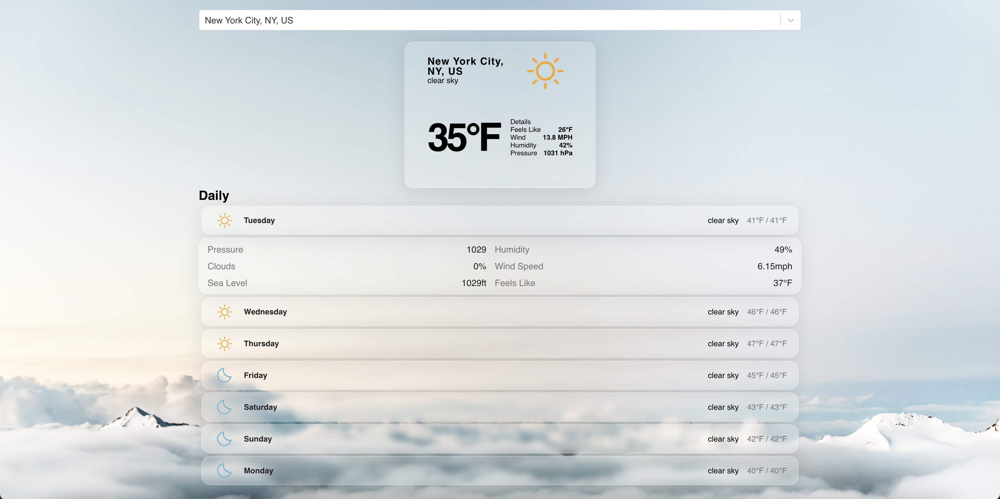

# Weather Dashboard
A website that uses the Reactjs framework to display weather data on a webpage. Based on the <a href="https://www.youtube.com/watch?v=Reny0cTTv24">freecodecamp course</a>

## APIs Used
- GeoDb
- OpenWeatherMap

## Technologies Used
- HTML  
- CSS 
- JavaScript 
- Reactjs 
- Nodejs  

